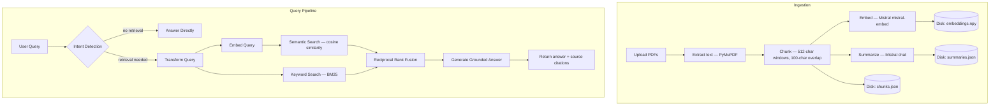

# RAG Pipeline

A retrieval-augmented generation pipeline built with FastAPI and a single-page HTML interface. It ingests PDF files, stores chunked text and embeddings on disk, performs hybrid retrieval with semantic similarity and BM25, and generates answers with Mistral AI.

## Architecture

```
  Upload PDFs
      │
      ▼
┌─────────────┐
│  Ingestion   │  extract text (PyMuPDF) → chunk (fixed-size + overlap)
│              │  → embed via Mistral → generate per-file summary via Mistral
│              │  → persist chunks.json + embeddings.npy + summaries.json
└──────────────┘

  User Query
      │
      ▼
┌─────────────┐
│   Query      │  intent detection (Mistral call w/ summaries as context)
│              │  → if no retrieval needed: answer directly, return
│              │  → if retrieval needed: transform query for better retrieval
└─────┬───────┘
      │
      ▼
┌─────────────┐
│   Search     │  semantic search (cosine similarity on embeddings)
│              │  + keyword search (BM25 from scratch)
└─────┬───────┘
      │
      ▼
┌──────────────┐
│ Postprocessing│  merge semantic + BM25 via Reciprocal Rank Fusion
│              │  → deduplicate → top-k
└─────┬───────┘
      │
      ▼
┌─────────────┐
│  Generation  │  prompt template + top-k chunks → Mistral → answer
└─────────────┘
```



## System Design

### Ingestion

PDF extraction uses [PyMuPDF](https://pymupdf.readthedocs.io/) because it is fast, self-contained, and handles a wide range of native PDF layouts without requiring external tools like Poppler. The chunking strategy is fixed-size character windows with overlap, but chunk boundaries try to end on sentence punctuation first so the retrieved text remains more coherent. This keeps implementation simple while still reducing the chance that important context is cut off between adjacent chunks. A limitation is that scanned PDFs without embedded text will not be OCR'd.

**Why 512-character chunks with 100-character overlap?** The chunk size is a tradeoff between context density and retrieval precision. Smaller chunks (e.g. 200 characters) often split sentences mid-thought and hurt the LLM's ability to reason over the context. Larger chunks (e.g. 1500+ characters) dilute the semantic signal, making cosine similarity less discriminating because each embedding averages over too many topics. 512 characters is a pragmatic middle ground: large enough to contain one or two complete sentences, small enough to keep embeddings focused. The 100-character overlap (~20%) ensures that sentences near boundaries appear in at least two chunks, so a relevant sentence is not lost simply because it fell on a split point. Character-based sizing (rather than token-based) was chosen to avoid coupling the chunking logic to a specific tokenizer, since the embedding model and chat model use different vocabularies.

### Query Processing

Each query first goes through intent detection using the document summaries as lightweight context. If retrieval is unnecessary (e.g. "hello", "what time is it?"), the app answers directly with Mistral. If retrieval is needed, the same model rewrites the user question into a more retrieval-friendly query, which helps both semantic embedding search and keyword matching land on better chunks. For example, a question like "What did they conclude about the efficiency?" might be rewritten as "conclusions efficiency results findings" to improve recall across both search methods.

### Search

Retrieval combines two signals: cosine similarity over stored embeddings and a BM25 implementation built from scratch over chunk text. Semantic search helps with paraphrases and concept matching, while BM25 catches exact wording, names, and domain-specific terms that embeddings can sometimes underweight. Using both gives more resilient retrieval than either method alone.

**Why build BM25 from scratch?** The assessment requires no external library for search or RAG. The BM25 implementation uses standard k1=1.5 and b=0.75 parameters, maintains per-chunk term frequencies, and recomputes document frequencies on each store update. It is correct for a demo-scale corpus; for production, an inverted index with incremental updates would be more efficient.

### Postprocessing

The two ranked lists are merged with Reciprocal Rank Fusion (RRF).

**Why RRF over other fusion methods?** The main alternatives are: (a) linear score combination, which requires normalizing semantic (cosine, 0–1) and BM25 (unbounded) scores to the same scale — a fragile process that needs per-query calibration; (b) learned-to-rank models, which need training data; and (c) round-robin interleaving, which ignores score magnitude entirely. RRF avoids all three problems: it depends only on rank position, not score magnitude, so no normalization is needed. It is parameter-light (only the constant k=60), stable across query types, and has been shown empirically to match or beat normalized score fusion in hybrid retrieval settings. It also naturally boosts chunks that appear in both result lists.

### Generation

Answer generation uses a grounded prompt that injects the selected chunks with filename and page metadata. The system prompt tells the model to answer only from the supplied context and to admit when the context is insufficient. That reduces hallucination risk and makes source attribution straightforward in the UI response.

## Environment Setup

**Prerequisites:**
- Python 3.10+
- A Mistral AI API key

**Setup:**

```bash
# Clone the repository
git clone https://github.com/your-username/RAG-Pipeline.git
cd RAG-Pipeline

# Create and activate a virtual environment
python3 -m venv venv
source venv/bin/activate   # On Windows: venv\Scripts\activate

# Install dependencies
pip install -r requirements.txt

# Create .env with your Mistral API key
echo "MISTRAL_API_KEY=your_key_here" > .env

# Start the server
uvicorn app.main:app --reload
```

Open [http://127.0.0.1:8000](http://127.0.0.1:8000) to access the UI.

**Running tests:**

```bash
pip install pytest pytest-asyncio
python -m pytest tests/ -v
```

## API Documentation

### `POST /ingest`

Accepts one or more PDF files via multipart form data. Each file is validated, extracted, chunked, embedded, summarized, and merged into the persisted local store.

**Example request:**

```bash
curl -X POST http://127.0.0.1:8000/ingest \
  -F "files=@document.pdf" \
  -F "files=@report.pdf"
```

**Example response (200):**

```json
{
  "status": "success",
  "filenames_processed": ["document.pdf", "report.pdf"],
  "chunk_count": 47,
  "errors": []
}
```

**Example response (partial success, 200):**

```json
{
  "status": "partial_success",
  "filenames_processed": ["document.pdf"],
  "chunk_count": 23,
  "errors": ["report.pdf: No extractable text was found in the PDF."]
}
```

### `POST /query`

Accepts a JSON body with a `query` string. The backend decides whether retrieval is necessary, optionally performs hybrid search, and returns the generated answer plus source references and a retrieval flag.

**Example request:**

```bash
curl -X POST http://127.0.0.1:8000/query \
  -H "Content-Type: application/json" \
  -d '{"query": "What are the main findings of the report?"}'
```

**Example response (with retrieval):**

```json
{
  "answer": "The report found that ...",
  "sources": [
    {"filename": "report.pdf", "page_number": 3, "chunk_index": 12},
    {"filename": "report.pdf", "page_number": 5, "chunk_index": 24}
  ],
  "retrieval_used": true
}
```

**Example response (no retrieval needed):**

```bash
curl -X POST http://127.0.0.1:8000/query \
  -H "Content-Type: application/json" \
  -d '{"query": "hello"}'
```

```json
{
  "answer": "Hello! How can I help you today?",
  "sources": [],
  "retrieval_used": false
}
```

### `GET /status`

Returns the number of ingested files, total chunks, and the filenames currently in the store.

**Example response:**

```json
{
  "ingested_files": 2,
  "total_chunks": 47,
  "filenames": ["document.pdf", "report.pdf"]
}
```

### `GET /`

Serves the single-page chat and upload interface.

## Design Tradeoffs & Evaluation Criteria

### Security

- **API key management:** The Mistral API key is loaded from a `.env` file excluded via `.gitignore`, never hardcoded or logged.
- **Input validation:** All request bodies are validated through Pydantic models with field constraints (e.g. `min_length=1` on query, `ge=1` on page numbers). Non-PDF uploads are rejected before processing.
- **Error isolation:** Ingestion processes each file independently; one failing PDF does not abort the batch. Mistral API errors are caught and returned as typed `ErrorResponse` objects with appropriate HTTP status codes (400, 502, 500).
- **LLM prompt boundaries:** The generation prompt separates system instructions from user-supplied context and query, which reduces (but does not eliminate) prompt injection risk. A production system would add additional sanitization and output validation layers.

### Scalability

- **Vector search** is a linear scan (`O(n)` cosine similarity over all embeddings). This is adequate for thousands of chunks but would need an approximate nearest-neighbor index (e.g. FAISS) for datasets exceeding ~100K chunks.
- **BM25 index** is rebuilt entirely on each ingestion. For large corpora, an incremental inverted index would avoid recomputation.
- **Storage** is file-based (JSON + NumPy). This works for single-process deployments but lacks concurrent write safety. A production system would use a database or object store.
- **Embedding computation** is batched (16 texts per request) but sequential across batches. Parallelizing API calls would reduce ingestion latency.
- **No query caching.** Repeated identical queries re-run the full pipeline. Adding an LRU cache on embeddings and LLM responses would reduce latency and API costs.
- **Single-worker Uvicorn.** Horizontal scaling would require externalizing state (e.g. Redis or a database) so multiple workers share the same store.

### Code Organization

The pipeline is split into focused modules:

| Module | Responsibility |
|---|---|
| `main.py` | FastAPI app, route handlers, orchestration |
| `models.py` | Pydantic data models (request/response schemas) |
| `ingestion.py` | PDF extraction, chunking, persistence |
| `search.py` | Hybrid search store (semantic + BM25) |
| `query.py` | Intent detection, query transformation |
| `generation.py` | Mistral API calls (chat, embeddings) |
| `postprocessing.py` | Reciprocal Rank Fusion |

Each module depends only on `models.py` and `generation.py`, avoiding circular imports. The `HybridSearchStore` class encapsulates all retrieval state and index management.

## Libraries Used

- [FastAPI](https://fastapi.tiangolo.com/) — async web framework with automatic OpenAPI documentation
- [Uvicorn](https://www.uvicorn.org/) — ASGI server
- [python-dotenv](https://pypi.org/project/python-dotenv/) — environment variable loading from `.env`
- [PyMuPDF](https://pymupdf.readthedocs.io/) — PDF text extraction
- [NumPy](https://numpy.org/) — numerical operations (embeddings, cosine similarity)
- [httpx](https://www.python-httpx.org/) — async HTTP client for Mistral API
- [python-multipart](https://pypi.org/project/python-multipart/) — multipart form data parsing for file uploads

## Bonus Features

Additional features implemented in the `bonus/` package.

### Similarity Threshold & Insufficient Evidence (`bonus/similarity_threshold.py`)

The pipeline refuses to answer when the best retrieved chunk does not meet a minimum cosine similarity threshold (default: 0.60), returning an "insufficient evidence" message instead of risking a hallucinated answer. The threshold is checked against the raw semantic search scores (cosine similarity, 0–1) before any rank fusion, since those scores reflect actual content relevance rather than rank position.

**Threshold calibration:** The default of 0.60 was chosen as a balanced gate for the `mistral-embed` model. Relevant queries typically score 0.75+ while completely off-topic queries fall below 0.60. The threshold is configurable per call.

**Example response (insufficient evidence):**

```json
{
  "answer": "I don't have sufficient evidence in the ingested documents to answer this question confidently. The retrieved chunks did not meet the minimum relevance threshold. Please try rephrasing your question or uploading more relevant documents.",
  "sources": [],
  "retrieval_used": true
}
```

### Query Refusal Policies (`bonus/query_refusal.py`)

Screens every incoming query before any LLM call or retrieval. Three policy categories are enforced:

- **PII detection:** Regex patterns catch email addresses, phone numbers, Social Security Numbers, and credit card numbers. Queries containing PII are immediately refused to protect user privacy.
- **Legal advice:** Detects phrases like "can I sue", "legal advice", "am I liable". Returns a disclaimer directing the user to a qualified attorney.
- **Medical advice:** Detects phrases like "should I take", "symptoms of", "is it safe to take". Returns a disclaimer directing the user to a healthcare professional.

The patterns are deliberately scoped to avoid false positives on academic queries (e.g. "What does the paper say about diagnosis accuracy?" passes through).

**Example response (PII refusal, HTTP 400):**

```json
{
  "error_type": "query_refused",
  "message": "Your query appears to contain personally identifiable information (PII). ...",
  "details": "PII detected: email address"
}
```

**Example response (medical refusal, HTTP 400):**

```json
{
  "error_type": "query_refused",
  "message": "Your query appears to request medical advice. I am an AI assistant and cannot provide medical diagnoses ...",
  "details": "Medical advice request"
}
```

### Hallucination Filter (`bonus/hallucination_filter.py`)

A post-hoc evidence check that runs after the LLM generates an answer. Each sentence in the answer is embedded and compared (cosine similarity) against the source chunks that were provided as context. Sentences that lack support — i.e. whose best-matching chunk falls below a configurable threshold (default: 0.70) — are stripped from the response, and a warning is appended.

**How it works:**
1. Split the answer into sentences.
2. Skip structural/meta sentences ("Based on the context...", "In summary...") — these don't make factual claims.
3. Embed all remaining claim sentences in a single batch.
4. For each claim, compute cosine similarity against all source chunk embeddings.
5. If the best similarity is below the threshold, the sentence is unsupported and removed.
6. If any sentences were removed, append a transparency warning to the answer.

**Example (filtered answer):**

```
Monocrystalline panels offer 20-22% efficiency. A typical 6kW system uses 16-20 panels.

[Note: Some parts of the original answer were removed because they could not be
verified against the source documents.]
```

### Answer Shaping (`bonus/answer_shaping.py`)

Detects the user's intent from the query using regex heuristics and selects a matching system prompt that guides the LLM toward structured output. No extra LLM call is needed — classification is purely rule-based.

**Supported shapes:**

| Shape | Trigger examples | Output format |
|---|---|---|
| **List** | "List the methods", "What are the approaches?" | Numbered/bulleted list |
| **Comparison** | "Compare A and B", "Pros and cons" | Table or side-by-side format |
| **Summary** | "Summarize", "Key findings", "TL;DR" | 2-4 concise sentences |
| **Definition** | "What is X?", "Define Y" | One-sentence definition + elaboration |
| **General** | Everything else | Free-form grounded answer |

Rules are checked in priority order (summary > comparison > list > definition) to handle overlapping patterns correctly. All prompts retain the grounding constraint ("Answer ONLY based on the provided context").

## Limitations and Future Improvements

- Scanned PDFs without embedded text are not supported because there is no OCR step.
- The chunking strategy is character-based rather than token-aware; a token-based approach could align better with model context windows.
- BM25 is fully in memory and rebuilt after updates — fine for small corpora, not for large-scale deployments.
- Ingestion and querying are synchronous from the user's perspective; background jobs or streaming progress would improve UX.
- No authentication or rate limiting on API endpoints. A production deployment would add API keys or OAuth and request throttling.
- No query caching — repeated queries re-run the full pipeline.
